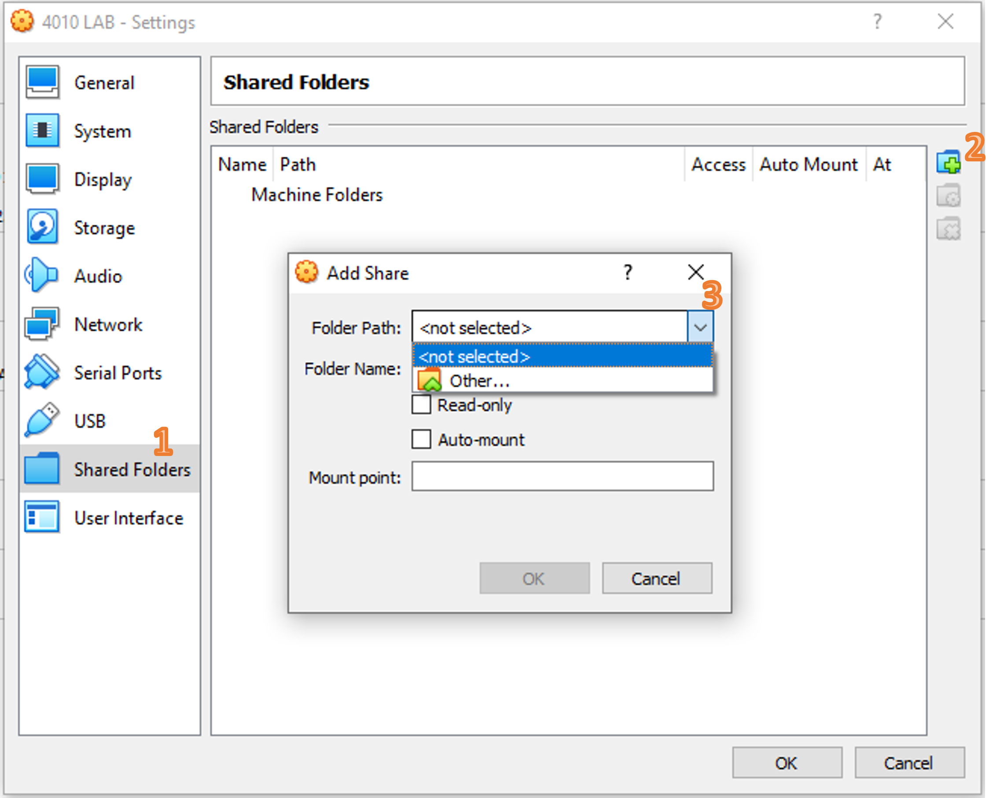
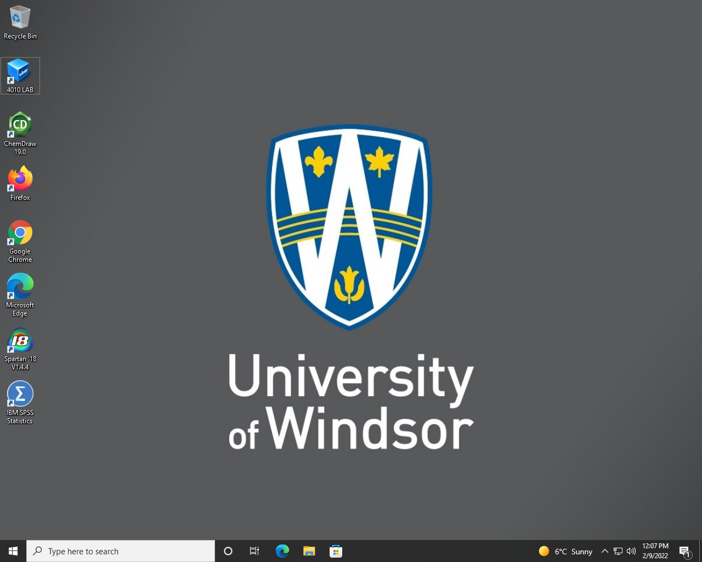

# BIOC-4010 Dry-Lab Resources

This repository includes codes, data, and files for the dry lab sessions of
BIOC-4010 at the University of Windsor. It has been in use since the 2022W
semester. The repository is being constantly updated for the most current
semester. Not all materials are uploaded in this repository, some documents
mentioned will be shared in the class, or through the Learning Management
System (Brightspace).

This course is offered to Students from Biology or Biochemistry background
with minimal experience in computer science.

If you are interested, you can take a look at my [journey](./History.md) of choosing the
Bioinformatics dry lab platform.

The material is released under Creative Commons [license](./LICENSE). You are
welcome to adopt it to your course. I need to clean up the folders and codes,
when I find some time to do it. Please send any comments to
`ytong_AT_uwindor_DOT_ca`.

Currently it contains five dry-lab sessions. The plan is to
1. provide more details on the instructions;
2. expand on the sessions.


| Tutorial # | Content |
| --- | --- |
| [tut1](./tut1/README.md) | Linux basics and Regular Expression |
| [tut2](./tut2/README.md) | Scoring matrices and dotplot |
| [tut3](./tut3/README.md) | Sequence alignment and BLAST |
| [tut4](./tut4/README.md) | Molecular Graphics with PyMOL |
| [tut5](./tut5/README.md) | Molecular phylogeny |

On March 24, 2023, [GitHub updated its RSA SSH host key](https://github.blog/2023-03-23-we-updated-our-rsa-ssh-host-key/),
in case you see a warning that REMOTE HOST IDENTIFCATION HAS CHANGED. Update
local `known_hosts` file accordingly. A new instance of the Linux VM should not
have an issue.

## Before you start the Linux VM
To use the Linux VM:
- First login the Windows desktop using your UWindsor email address and
  your account password.
- Additional setup for the VM — you only need to do this once:
  * Setup shared folder, clipboard and file dragging
    + Start the `Oracle VM Virtual Manager`;
    + Select the `4010Lab`, click `Settings` on the right panel;
    + In the pop-up dialog, click on `Shared Folders`, and select the "add new
      share folder" icon, and select the pull down menu next to "Folder Path";

    + It is recommended to select and choose the `Downloads` folder of the host
    + machine for sharing contents, check the 'Auto-mount' box, and click 'OK'
      to close the 'Add Share' dialog;
    + In the `Settings` of `4010Lab`, choose `General` → `Advanced` tab and
      change `Shared Clipboard` and `Drag'n'Drop` from `Disabled` to
      `Bidirectional`.
    + Click 'OK' to close the '4010Lab - Settings'.
- Select the `4010Lab` icon on the desktop, double click the icon to
  launch the Linux VM, or you can launch the VM from `Oracle VM Virtual
  Manager`. The actual number of icons in the desktop interface may be
  slightly different since new software may be added for other courses. But
  you should see a blue `4010LAB` icon.

  You should be automatically logged into the Linux VM under the `science`
  account. The instructor or the GA/TA will provide you the password if needed.

- One final update to install the Guest Additions in the Linux VM — you only need
  to do this once:
  * Download the [Guest Additions iso](http://download.virtualbox.org/virtualbox/6.1.32/VBoxGuestAdditions_6.1.32.iso) from
    http://download.virtualbox.org/virtualbox/6.1.32/ and save to `Downloads`
    folder of the host computer.
  * Launch the Linux VM
  * Inside the Linux VM, choose `VBox_GAs_6.1.14`, click mouse right button
    and select `eject`, the CD icon should disappear from the desktop
  * Outside the Linux VM in the Oracle VM VirtualBox menu, choose `Devices` →
    `Optical Drives` → choose the downloaded `VBoxGuestAdditions_6.1.32.iso`
    file.
  * A new CD icon will show up in the Linux VM and a pop-up dialog asking
    whether you want to run the software on the CD, choose `Run`, and enter
    the password to `Authenticate`.
  * After finish installation, restart the Linux VM.
  * You should be able to share content between the Linux VM and the host
    machine.

### Sanity check
- Check the Linux VM desktop and make you see an icon labelled `sf_Downloads`
which is the shared folder `Downloads` of the host machine.

- Open Notepad in the host machine type some text and copy by selecting and
  press `Ctrl+C`. In the Linux VM, start a Terminal, click mouse right button
  and choose `Paste` and see whether the text is pasted. Press `Ctrl+C` to
  break the input in the Terminal.
- Create a `test.txt` file on the host Windows desktop and see whether you can
  drag and drop into the Linux VM.
- Remember that the `sf_Downloads` folder in the Linux VM is the folder you
  can used to transfer files between the Linux VM and the host Windows
  computer. You can also use the Firefox browser inside the Linux VM to upload
  files to OneDrive or Brightspace.
- To make a screenshot, press the "PrtSc" button and the Linux will ask you
  where to save the screenshot. I suggest you save it in the `sf_Downloads`
  folder.

### Navigate in the Linux VM
- 

### Using the Linux VM for BIOC4010

The github `bioc4010` repository has been cloned into the VM already, so after
you login the Linux VM, start a terminal and type
```
cd bioc4010
git pull
```
to enter the `bioc4010` directory to see the files and pull changes made to the
repository. This will include all the changes made to the sub-directories.

If you have made changes to downloaded files, and have trouble pulling updates
from github. Run the following command to put away these changes before you
pull for the updates.

```
git stash
git pull
```

After you login the Linux VM and made the above updates, enter the directories
corresponding to individual tutorial and follow the README.md file in each
directory.

