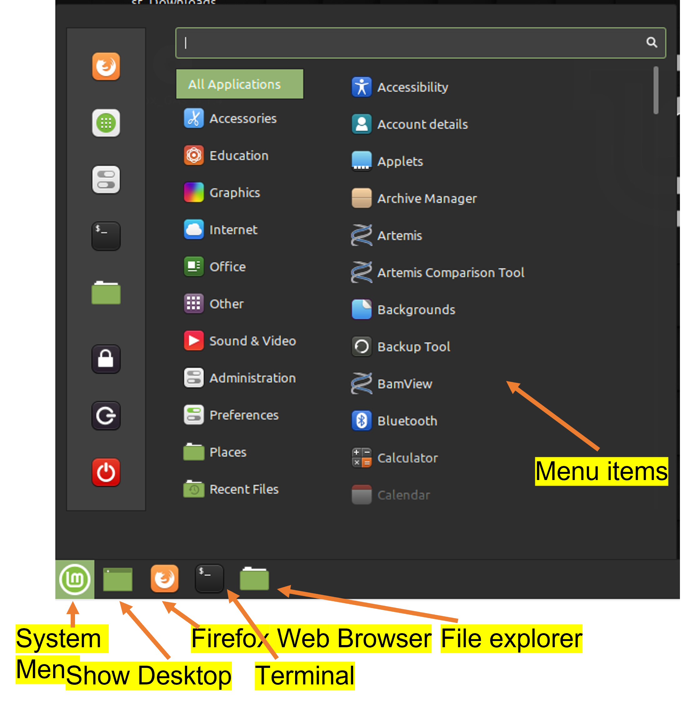

# BIOC-4010 Resources

This repository includes codes, data, and files for the dry lab sessions of
BIOC-4010 at the University of Windsor. It has been in use since the 2021W
semester. The repository is being constantly updated for the most current
semester.

## Update in 2022W

Due to an upgrade of the UWindsor ITS infrastructure in late 2021, some
programs, esp. the PyMOL (Native Windows App) in the Windows 10 virtual
machine(VM) used in previous sessions no longer works. Much time was spent
trouble-shooting in vain. To work around the technical issue, we switch back
to a Linux Mint VM that was first built for the 2020W session. The VM is
installed on all desktops at the Science Resource Centre in the Essex Hall (EH
182-1). The VM is 8G in size and can also be downloaded as a Course material
and installed in students' own laptops. The VM was built for Oracle VirtualBox
verion 6.1, and is known to cause problems for Oracle VirtualBox version 6.3.

Scripts and README files are updated to fit the Linux VM. Some old scripts are
kept for now, and will be eventually removed.

### Before you start the Linux VM
To use the Linux VM:
- First login the Windows desktop using your UWindsor email address and
  your account password.
- Additional setup for the VM — you only need to do this once:
  * Setup shared folder, clipboard and file dragging
    + Start the `Oracle VM Virtual Manager`;
    + Select the `4010Lab`, click `Settings` on the right panel;
    + In the pop-up dialog, click on `Shared Folders`, and select the "add new
      share folder" icon, and select the pull down menu next to "Folder Path";

    + It is recommended to select and choose the `Downloads` folder of the host
    + machine for sharing contents, check the 'Auto-mount' box, and click 'OK'
      to close the 'Add Share' dialog;
    + In the `Settings` of `4010Lab`, choose `General` → `Advanced` tab and
      change `Shared Clipboard` and `Drag'n'Drop` from `Disabled` to
      `Bidirectional`.
    + Click 'OK' to close the '4010Lab - Settings'.
- Select the `4010Lab` icon on the desktop, double click the icon to
  launch the Linux VM, or you can launch the VM from `Oracle VM Virtual
  Manager`.

  You should be automatically logged into the Linux VM under the `science`
  account. The instructor or the TA will provide you the password if needed.

- One final update to install the Guest Additions in the Linux VM — you only need
  to do this one:
  * Inside the Linux VM, choose `VBox_GAs_6.1.14`, click mouse right button
    and select `eject`, the CD icon should disappear from the desktop
  * Outside the Linux VM in the Oracle VM VirtualBox menu, choose `Devices` →
    `Optical Drives` → choose `VBoxGuestAdditions.iso`
  * A new CD icon will show up in the Linux VM and a pop-up dialog asking
    whether you want to run the software on the CD, choose `Run`, and enter
    the password to `Authenticate`.
  * After finish installation, restart the Linux VM.

### Sanity check
- Check the Linux VM desktop and make you see an icon labelled `sf_Downloads`
which is the shared folder `Downloads` of the host machine.

- Open Notepad in the host machine type some text and copy by selecting and
  press `Ctrl+C`. In the Linux VM, start a Terminal, click mouse right button
  and choose `Paste` and see whether the text is pasted. Press `Ctrl+C` to
  break the input in the Terminal.
- Create a `test.txt` file on the host Windows desktop and see whether you can
  drag and drop into the Linux VM.

### Navigate in the Linux VM
- 

### Using the Linux VM for BIOC4010

The github `bioc4010` repository has been cloned into the VM already, so after
you login the Linux VM, start a terminal and type
```
cd bioc4010
git pull
```
to enter the directory to see the files and pull changes made to the
repository. This will include all the changes made to the sub-directories.

If you have made changes to downloaded files, and have trouble pulling updates
from github. Run the following command to put away these changes before you
pull for the updates.

```
git stash
git pull
```

After you login the Linux VM and made the above updates, enter the directories
corresponding to individual tutorial and follow the README.md file in each
directory.

