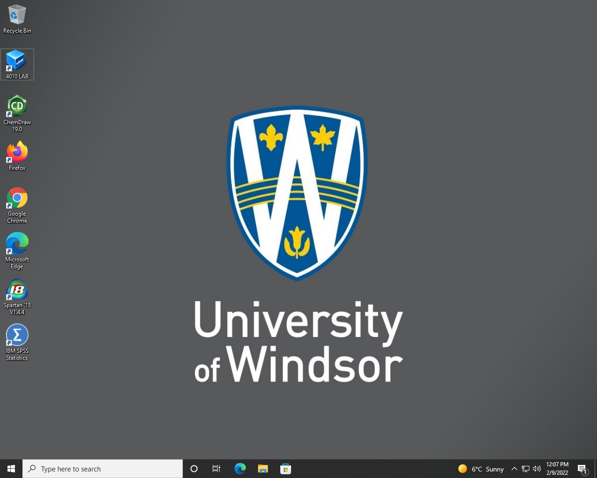

# Tutorial 1

Tutorial 1 is for students to get familiar with Linux system, command line
interface. Learn how to run basic shell commands and use regular expression.

1. Step 1
Login the Windows computer using your UWindsor email address and password.

Select the `4010Lab` icon on the desktop, and launch the program


You should be automatically logged into the Linux system under `science`
account.

1. Install the `tree` program

```
sudo apt install tree
```

## Notes 2021W (obsolete)
The setup was based on existing build of the VM and the setuptut1.sh screen
will be depreciated.

