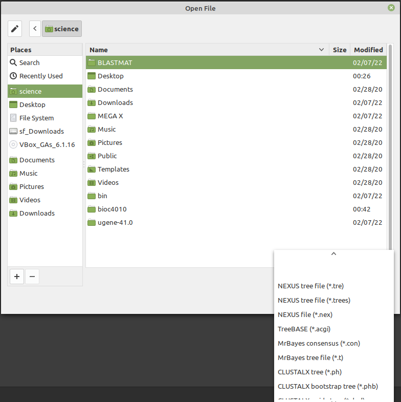

# Tutorial 3: Sequence Alignment and Advanced BLAST
Make sure you run the `setup.sh` file under `~/bioc4010` folder to fix a bug
that prevent the launch of `clustalx` The following instructions assume you are
in the `~/bioc4010/tut3` folder.  The `setup.sh` script also create a symbolic
link under `tut3` folder to the Windows `Downloads` folder. You shall copy the
output results from the programs to the `Downloads` folder so that you can
access them in the Web browser using a command like below:
```
cp *.dnd *.ph Downloads
```
The above example copies Newick guide tree and weighted tree files to the
`Downloads` folder. If you need to copy other files, change the `*.dnd *.ph`
correspondingly.

## PDB Search
Search in [RCSB PDB](https://www.rcsb.org/) for "lopinavir" and "ritonavir", and find out:
1. the ligand ID of these two drugs; (hint: look for "Unique Ligands" in the
   summary of a PDB)
2. how many structures are associated with these two drugs.
   (hint: click the ligand ID in step 1, it will present a new page of the
   structure of the ligand. On the right side of the page show the ligand 'is
   present as a standalone ligand in _nn_ entries'.

## Sequence comparison and BLASTP

### Compare pairwise sequence alignment
Observe the difference in the output of the following three methods:
```
#needleman alignment
needle 3ogq.fa 4l1a.fa

#waterman alignment
water 3ogq.fa 4l1a.fa

#BLASTP
blastp -query 3ogq.fa -subject 4l1a.fa
```

### BLASTP
- compare two sequence sets. the `ab1-targets.fa` includes all the FASTA
  format sequence of proteins that have a co-crystal structure with 'ab1',
  i.e. lopinavir.

```
blastp -query ab1-targets.fa -subject ab1-targets.fa -outfmt 6
```
What did you observe?

- Search for closest match of `4l1a.fa` in ritonavir target sequences
```
blastp -query 4l1a.fa -subject rit-target.fa -outfmt 6
```

## CLUSTALX and MSA

The documentation of the `clustalx` program can be found at the [unl.edu](http://bioinfolab.unl.edu/emlab/documents/clustalx_doc/clustalx.html)
website. Take a read if you want to know the details.

Enter `tut3` directory, and invoke the program in Ubuntu Terminal using `clustalx`.

The following is a simple procedure to generate an alignment and a weighted
(phylogenetic) tree using N-J clustering.

1. `File` → `Load sequence`, load `nosplitusp.fa` file.
2. `Alignment` → `Do a complete alignment` will generate a guide tree (a `.dnd`
   file ) and an alignment file (`.aln`).
3. `Trees` → `Draw Tree` will use N-J method to generate a unrooted tree.

The guide tree and N-J tree files are in Newick format. They can be viewed
using any online Newick Tree Viewer, e.g. the [Uqam Tree Viewer](http://trex.uqam.ca/index.php?action=newick)

Or you can use the TreeViewX program to view it:
- Click the Linux Mint Menu and search for `treeviewx` and lunch it.
- Open the .`ph` file generated by clustalx, make sure you set the file filter
  to 'CLUSTERX tree(\*.ph)


## List of files in this tutorial
- 3ogq.fa         FASTA sequence of PDB:3OGQ
- 4l1a.fa         FASTA sequences of PDB: 4L1A, note that the deposited
  sequences may contain a mistake that the two polypeptide chains are not
  identical
- ab1-target.fa   FASTA sequences of all co-crystal structures in complex with
  ligand AB1
- allusps.fa      FASTA sequences of all USPs
- lopinavir.pdbhits   PDB codes for all Lopinavir co-complexes
- lopinavir.pdbinfo   Info of all Lopinavir co-complex structurs
- nosplitusp.fa   FASTA sequences of all USPs that do not have insertions
- README.md       This file
- rit-target.fa   FASTA sequences of all co-crystal structures in complex with
  ligand RIT
- ritonavir.pdbhits   PDB codes for all ritonavir co-complexes
- ritonavir.pdbinfo   Info of all Ritonavir co-complex structures
- treeviewx.png
- usp9xcd.fa      FASTA sequence of USP9X catalytic domain
